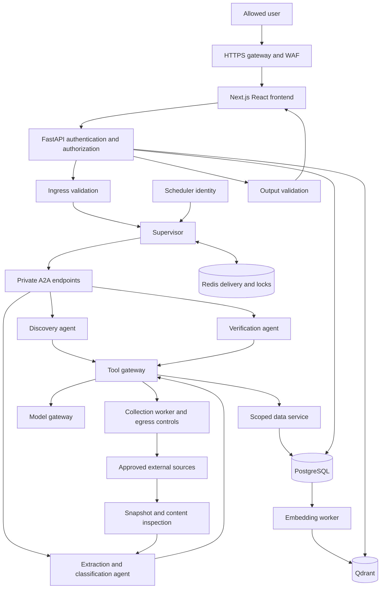

> Current deployment decision: ADR 0002 supersedes all shared-service references below. Jobsearch uses separate PostgreSQL, Qdrant and Redis containers, credentials, volumes and networks.

# Architecture

Date: 2026-09-11. This document specifies intended behavior, not completed implementation.

## Requirements and boundaries

Find US executive data/AI/technology roles across approved sources. Include both Chief Data Officer and Chief Digital Officer. Titles such as CDO and Head of Data require contextual interpretation. Start with public ATS feeds and policy-approved career pages; discovery of company boards is a separate responsibility from collecting a known board.

Use the existing PostgreSQL database with a dedicated Jobsearch schema/role, the existing Qdrant service with isolated collections, and a React frontend. All project changes belong to Jobsearch. Shared service configuration changes require an explicit review of effects on the library system before execution.

## Components

Identity, policy enforcement, audit collection, and telemetry apply across all component boundaries; they are not optional agent steps.

## Service contracts

| Component | Responsibility | Excluded authority |
|---|---|---|
| Frontend | Search, job details, personal tracking, review and operations views | Direct DB/vector credentials |
| API | Validate identity, authorization, schemas and user-resource ownership | Trust browser-supplied roles |
| Supervisor | Create tasks, allocate budgets, route and reconcile results | Arbitrary shell/SQL, self-expanding permissions |
| Discovery agent | Propose sources using approved search providers | Automatically trust arbitrary domains or Agent Cards |
| Collection worker | Fetch approved endpoints with bounded resource use | Reach internal networks using source-supplied URLs |
| Extraction/classification agent | Produce structured proposals with supporting spans | Publish unsupported facts or change policy |
| Verification agent | Check evidence and eligibility; request publication | Override mandatory validation failures |
| Data service | Enforce schema, transactions, ownership and domain transitions | Library writes |
| Embedding worker | Index validated descriptions; track model version | Treat Qdrant as authoritative job state |
| Scheduler | Initiate configured recurring jobs and record outcomes | Inherit administrator privileges |

An agent is a responsibility boundary; not every deterministic stage needs its own LLM or network service. A2A is used across independently deployed agent boundaries. Queue delivery and direct internal function calls retain their own contracts.

## Processing and freshness

1. Discover candidate sources and evaluate a versioned source-access policy.
2. Fetch through the egress gateway. Record attempts, success, response metadata and timing.
3. Save a restricted source snapshot and content hash. Inspect content before model use.
4. Normalize fields and separate original values from derived values.
5. Apply deterministic title/country rules. Use a bounded model call for ambiguity.
6. Resolve duplicates while retaining original listings, requisitions and location variants.
7. Verify facts and evidence; publish matches or route uncertainty to review.
8. Commit data and an outbox event together. Index asynchronously and reconcile failures.
9. Serve only authorized records with explicit freshness and verification status.

Source failure never closes jobs. A successful complete board check may mark a listing not observed; closure requires configured confirmation or explicit source evidence. Partial/paginated failures cannot justify absence. Reappearing listings retain observation history.

US classification: `us_based`, `us_remote_eligible`, `outside_us`, `unknown`. Remote alone is insufficient. Geography is distinct from sponsorship/work authorization, which remains unknown unless explicitly stated.

## Reliability

At-least-once task delivery with idempotent handlers. PostgreSQL task state is durable; Redis is not the sole record. Use leases, bounded retries, jitter, deadlines, dead-letter handling and restart reconciliation. A transactional outbox prevents committed data from silently missing indexing work. Concurrency, source rates, tokens and spend all have explicit limits; values are pending.

## UI scope

Jobs/search; job detail/evidence; saved jobs and personal application status; review queue; sources/runs; administrative settings. Refresh is asynchronous with task status. A failed generated summary must not hide independently validated source facts.

No automated job application or outbound recruiter communication is included. Digest delivery remains pending a user-authorized destination.
